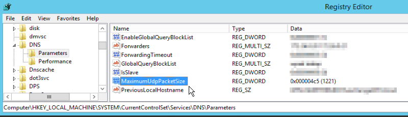
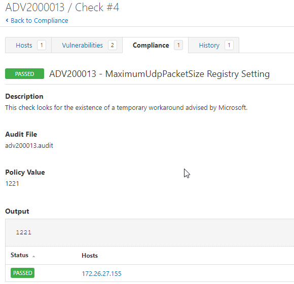

# ADV200013
A flaw was discovered in Windows DNS services, https://msrc.microsoft.com/update-guide/vulnerability/ADV200013. As part of a stopgap measure until systems can be patched, Microsoft released a recommended registry key change.

Tenable audits can be used to check for the existence of this specific key and value.

## Audit information

Let's break down the audit and examine each section.

1. This conditional uses PowerShell to verify if the ‘dns’ service is found.
```
<if>
  <condition type:"AND">
    <custom_item>
      type            : AUDIT_POWERSHELL
      description     : "Check for the DNS service"
      value_type      : POLICY_TEXT
      value_data      : "Pass"
      powershell_args : "$service=$(get-service | where {$_.Name -like 'dns'}); if($service) { $result='Pass' } else { $result='Fail'}; $result"
    </custom_item>
  </condition>
```
2. If the conditional is true, execute the <then></then> block. The Windows compliance plugin reads registry DWORD values as the binary equivalent, and in this case 0x000004C5 is 1221. This is also seen when entering the value in the registry

```
  <then>
   <custom_item>
      type        : REGISTRY_SETTING
      description : "ADV200013 - MaximumUdpPacketSize Registry Setting"
      #<content snipped for brevity>
      value_type  : POLICY_DWORD
      value_data  : 1221
      reg_key     : "HKLM\SYSTEM\CurrentControlSet\Services\DNS\Parameters"
      reg_item    : "MaximumUdpPacketSize"
      reg_option  : CAN_NOT_BE_NULL
    </custom_item>
  </then>
```
3. If the conditional is false, execute the <else></else> block. This will return a PASSED report stating the service was not found. If it is desired to not have this report and return nothing, the entire <else></else> section can be deleted.
```
  <else>
    <report type: "PASSED">
      description : "ADV200013 - MaximumUdpPacketSize Registry Setting"
      info        : "The Windows DNS service was not found. This check is not applicable."
    </report>
  </else>
</if>
```
Please note if you do not want/need this 'else' report, delete the entire <else><else> block.

The full audit will produce the following results when scanned against targets:

