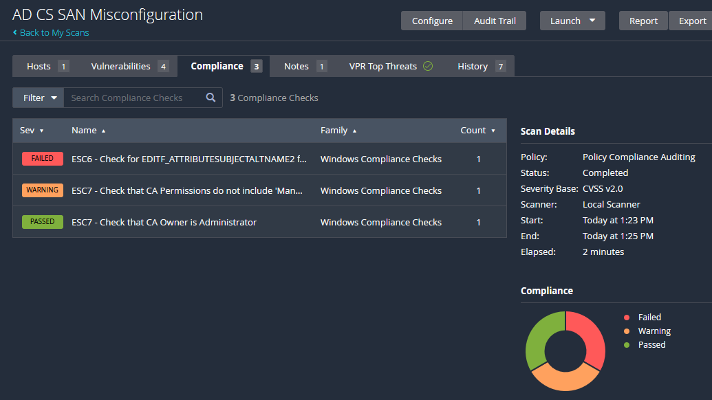
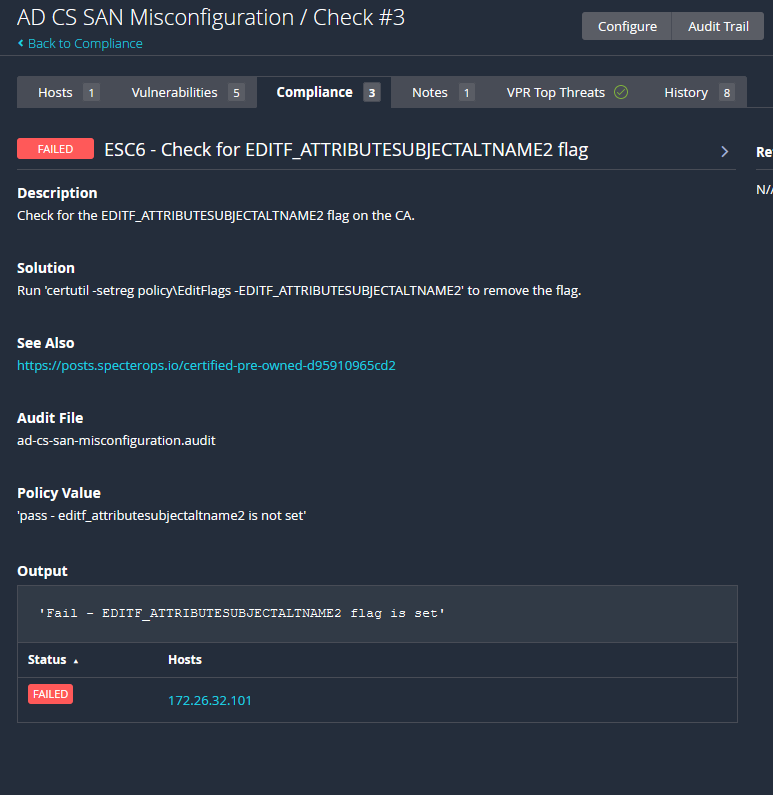
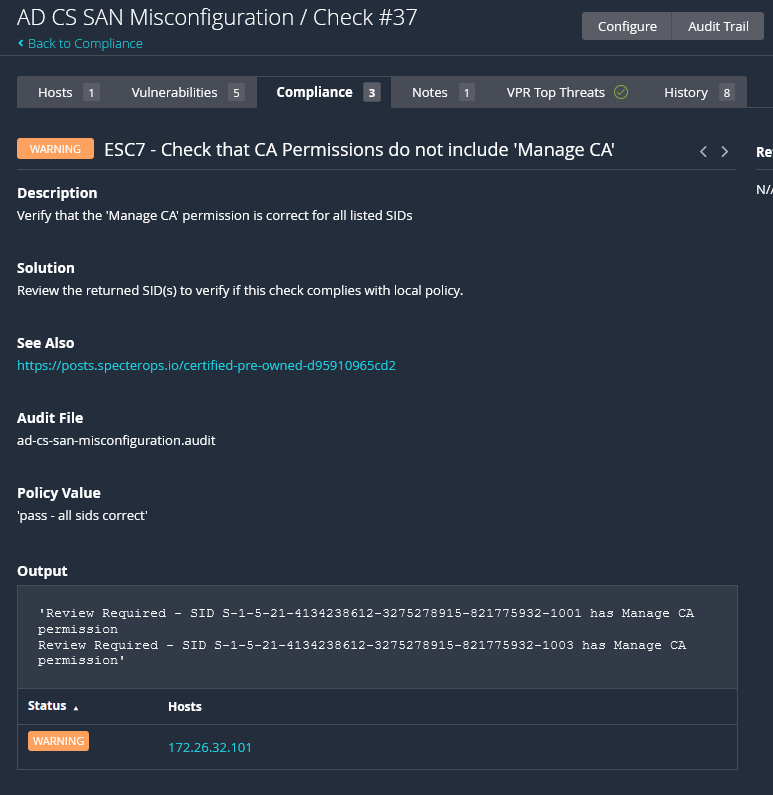

# Active Directory Certificate Services SAN Misconfiguration
Microsoft Active Directory supports the use of certificates to authenticate to resources (through an extension of Kerberos called PKINIT).

ADCS servers are the PKI servers in a Windows environment and with those servers, it is possible to issue authentication certificates (using the correct Extended Key Usage).

Blueprints of future certificates to issue are being called certificate templates (generally stored in the Active Directory).

A misconfiguration in the registry of ADCS servers can allow users to define a Subject Alternative Name (SAN) for any certificate template, even if they are configured properly initially. This feature allows to set another subject for the certificate and as such to authenticate as another account. This can become dangerous if this account is set to a privileged account in Active Directory (ex: a member of the Domain Admins group).

Tenable audits can be used to check for the existence of this misconfiguration.

## Audit Information

This audit first checks that the AD CS role is present on the target:

```
<if>
  <condition type:"AND">
    <custom_item>
      type        : REGISTRY_SETTING
      description : "Check for ADCS Role in registry"
      value_type  : POLICY_DWORD
      value_data  : 1
      reg_key     : "HKLM\SOFTWARE\Microsoft\ServerManager\ServicingStorage\ServerComponentCache\ADCS-Cert-Authority"
      reg_item    : "InstallState"
      reg_option  : CAN_NOT_BE_NULL
    </custom_item>
  </condition>
```

If this is true, then execute ESC6 and ESC7 checks based on [SpecterOps.io](https://posts.specterops.io/certified-pre-owned-d95910965cd2).

### ESC6
```
    <custom_item>
      type            : AUDIT_POWERSHELL
      description     : "ESC6 - Check for EDITF_ATTRIBUTESUBJECTALTNAME2 flag"
      info            : "Check for the EDITF_ATTRIBUTESUBJECTALTNAME2 flag on the CA."
      solution        : "Run 'certutil -setreg policy\EditFlags -EDITF_ATTRIBUTESUBJECTALTNAME2' to remove the flag."
      value_type      : POLICY_TEXT
      value_data      : "Pass - EDITF_ATTRIBUTESUBJECTALTNAME2 is not set"
      powershell_args : '$output = \\"\\"; $caName = Get-ItemPropertyValue -Path HKLM:SYSTEM\\CurrentControlSet\\Services\\CertSvc\\Configuration -name Active; $editFlags = Get-ItemPropertyValue -Path \\"HKLM:SYSTEM\\CurrentControlSet\\Services\\CertSvc\\Configuration\\$caName\\PolicyModules\\CertificateAuthority_MicrosoftDefault.Policy\\" -name EditFlags; if ($editFlags -band 0x40000) { $output = \'Fail - EDITF_ATTRIBUTESUBJECTALTNAME2 flag is set\' } else { $output = \'Pass - EDITF_ATTRIBUTESUBJECTALTNAME2 is not set\' }; $output;'
    </custom_item>
```
### ESC7
Check for CA owner
```
    <custom_item>
      type            : AUDIT_POWERSHELL
      description     : "ESC7 - Check that CA owner is Administrator"
      info            : "Verify that the CA owner is Administrator."
      solution        : "Review the returned SID to verify if this check complies with local policy."
      value_type      : POLICY_TEXT
      value_data      : "Pass - Owner SID is Administrator: S-1-5-32-544"
      powershell_args : '$output = \\"\\"; $caName = Get-ItemPropertyValue -Path HKLM:SYSTEM\\CurrentControlSet\\Services\\CertSvc\\Configuration\ -name Active; $regData = Get-ItemPropertyValue -Path \\"HKLM:\\SYSTEM\\CurrentControlSet\\Services\\CertSvc\\Configuration\\$caName\\" -name Security; $caSecurityDescriptor = New-Object Security.AccessControl.RawSecurityDescriptor($($regData), 0); $caOwner = $caSecurityDescriptor.Owner; if ($caOwner.Value -eq \'S-1-5-32-544\'){ $output = \\"Pass - Owner SID is Administrator: $caOwner\\" } else { $output = \\"Review Required - Owner SID is not Administrator: $caOwner\\" }; $output'
	  severity        : MEDIUM
    </custom_item>
```
Check for 'Manage CA' permission
```
    <custom_item>
      type            : AUDIT_POWERSHELL
      description     : "ESC7 - Check that CA Permissions do not include 'Manage CA'"
      info            : "Verify that the 'Manage CA' permission is correct for all listed SIDs"
      solution        : "Review the returned SID(s) to verify if this check complies with local policy."
      value_type      : POLICY_TEXT
      value_data      : "Pass - All SIDs correct"
      powershell_args : '$output = \\"\\"; $caName = Get-ItemPropertyValue -Path HKLM:SYSTEM\\CurrentControlSet\\Services\\CertSvc\\Configuration -name Active; $regData = Get-ItemPropertyValue -Path \\"HKLM:\\SYSTEM\\CurrentControlSet\\Services\\CertSvc\\Configuration\\$caName\\" -name Security; $caSecurityDescriptor = New-Object Security.AccessControl.RawSecurityDescriptor($($regData), 0); ForEach ($value in $caSecurityDescriptor.DiscretionaryAcl){ $sid = $value.SecurityIdentifier.value; $accessMask = $value.AccessMask; $aceType = $value.AceType; if( ($sid -eq \\"S-1-5-32-544\\") -or ($sid -like \\"S-1-5-21-*-512\\") -or ($sid -like \\"S-1-5-21-*-519\\") ) { continue } else { if(($aceType -eq \'AccessAllowed\') -and ($accessMask % 2 -eq 1)){ $output += \\"Review Required - SID $sid is not trusted for the ManageCA right on the CA`n\\" } } }; if(!$output){ $output = \'Pass - All SIDs correct\'; }; $output;'
      severity        : MEDIUM
    </custom_item>
```

The audit will produce results like the following:





