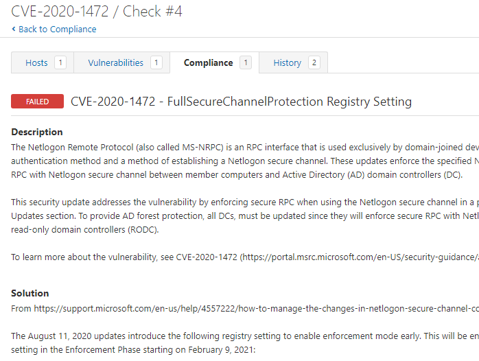
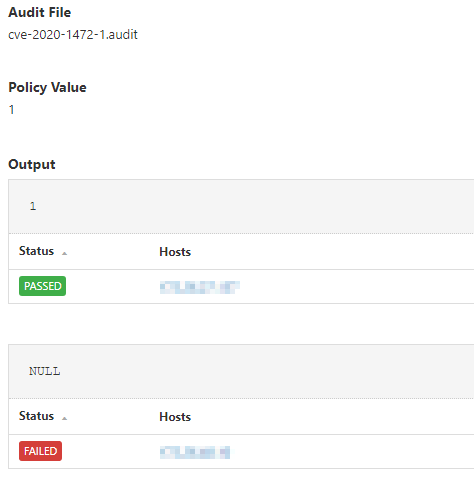

# CVE-2020-1472
From [https://portal.msrc.microsoft.com/en-US/security-guidance/advisory/CVE-2020-1472](https://portal.msrc.microsoft.com/en-US/security-guidance/advisory/CVE-2020-1472):

*An elevation of privilege vulnerability exists when an attacker establishes a vulnerable Netlogon secure channel connection to a domain controller, using the Netlogon Remote Protocol (MS-NRPC). An attacker who successfully exploited the vulnerability could run a specially crafted application on a device on the network.

To exploit the vulnerability, an unauthenticated attacker would be required to use MS-NRPC to connect to a domain controller to obtain domain administrator access.*

Additional information can be found [here](https://support.microsoft.com/en-us/help/4557222/how-to-manage-the-changes-in-netlogon-secure-channel-connections-assoc).

Tenable audits can be used to check for the existence of this specific key and value.

## Audit information

The audit uses a conditional to verify that the target is a domain controller:

1. This conditional uses PowerShell to verify if the correct target type is found.
```
<if>
  <condition type:"AND">
    <custom_item>
      type            : AUDIT_POWERSHELL
      description     : "Check that the target is an Active Directory controller"
      value_type      : POLICY_TEXT
      value_data      : "Pass"
      powershell_args : "$type=$((Get-WmiObject -Class Win32_OperatingSystem).ProductType); if($type -eq 2) { $result='Pass' } else { $result='Fail'}; $result"
    </custom_item>
  </condition>
  <then>
```
2. If the conditional is true, execute the <then></then> block. The Windows compliance plugin returns the registry value of `FullSecureChannelProtection`.
```
  <custom_item>
    type        : REGISTRY_SETTING
    description : "CVE-2020-1472 - FullSecureChannelProtection Registry Setting"
    <content snipped for brevity>
    value_type  : POLICY_DWORD
    value_data  : 1
    reg_key     : "HKLM\SYSTEM\CurrentControlSet\Services\Netlogon\Parameters"
    reg_item    : "FullSecureChannelProtection"
    reg_option  : CAN_NOT_BE_NULL
  </custom_item>
```
3. If the conditional is false, execute the <else></else> block. This will return a PASSED report stating the target was not identified as a Domain Controller.
```
</then>
<else>
  <report type: "PASSED">
    description : "CVE-2020-1472 - FullSecureChannelProtection Registry Setting"
    info        : "The target was not identified as a Domain Controller. This check is not applicable."
  </report>
</else>
</if>
```
Please note if you do not want/need this `else` report, delete the entire `<else><else>` block.

The full audit will produce the following results when scanned against targets:


In this example, two hosts were scanned, one that is compliant with the setting and a second that is not.

