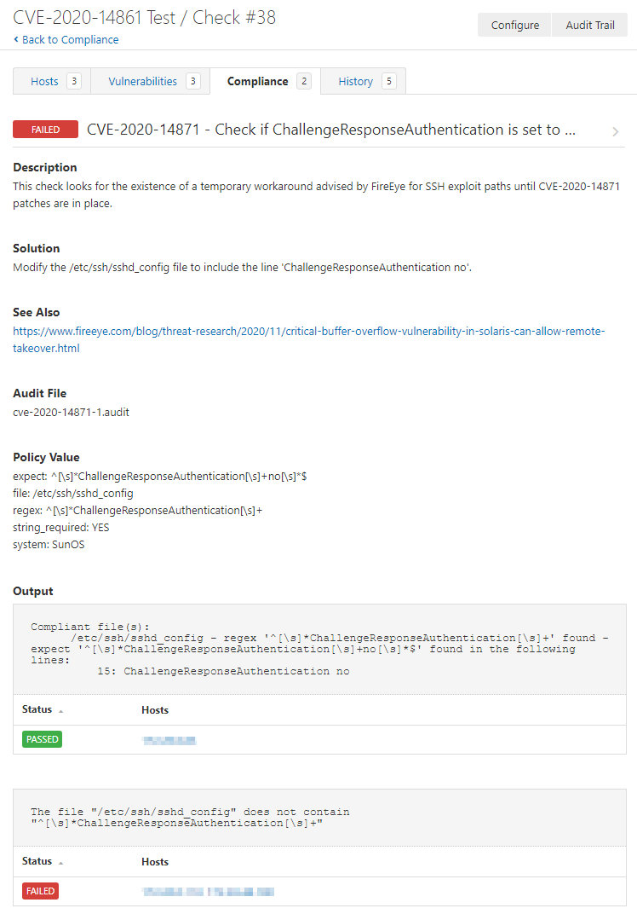

# CVE-2020-14871

## [Tenable: Critical Buffer Overflow in Oracle Solaris](https://www.tenable.com/blog/cve-2020-14871-critical-buffer-overflow-in-oracle-solaris-exploited-in-the-wild-as-zero-day)
## [Tenable: CVE-2020-14871](https://www.tenable.com/cve/CVE-2020-14871)
## [FireEye: CVE-2020-14871](https://www.fireeye.com/blog/threat-research/2020/11/critical-buffer-overflow-vulnerability-in-solaris-can-allow-remote-takeover.html)

Vulnerability in the Oracle Solaris product of Oracle Systems (component: Pluggable authentication module). Supported versions that are affected are 10 and 11. Easily exploitable vulnerability allows unauthenticated attacker with network access via multiple protocols to compromise Oracle Solaris. While the vulnerability is in Oracle Solaris, attacks may significantly impact additional products. Successful attacks of this vulnerability can result in takeover of Oracle Solaris. CVSS 3.1 Base Score 10.0 (Confidentiality, Integrity and Availability impacts). CVSS Vector: (CVSS:3.1/AV:N/AC:L/PR:N/UI:N/S:C/C:H/I:H/A:H).

Additional information can be found [here](https://www.oracle.com/security-alerts/cpuoct2020.html).

Tenable audits can be used to check for the existence of this specific key and value.

## Audit information

The audit uses a conditional to verify that the target is Solaris:

1. This conditional verifies that Solaris 9, 10, or 11 is installed.
```
<if>
  <condition type:"AND">
    <custom_item>
      type        : FILE_CONTENT_CHECK
      description : "Solaris 9, 10, or 11 is installed"
      file        : "/etc/release"
      regex       : ".*Solaris[\\s]+(9|10|11)"
      expect      : ".*Solaris[\\s]+(9|10|11)"
    </custom_item>
  </condition>
  
```
2. If the conditional is true, execute the `<then></then>` block. The Unix compliance plugin returns values found in `/etc/ssh/sshd_config`.
```
  <then>
    <custom_item>
      system          : "SunOS"
      type            : FILE_CONTENT_CHECK
      description     : "CVE-2020-14871 - Check if ChallengeResponseAuthentication is set to no and not commented."
      info            : "This check looks for the existence of a temporary workaround advised by FireEye for SSH exploit paths until CVE-2020-14871 patches are in place."
      solution        : "Modify the /etc/ssh/sshd_config file to include the line 'ChallengeResponseAuthentication no'."
      see_also        : "https://www.fireeye.com/blog/threat-research/2020/11/critical-buffer-overflow-vulnerability-in-solaris-can-allow-remote-takeover.html"
      file            : "/etc/ssh/sshd_config"
      regex           : "^[\\s]*ChallengeResponseAuthentication[\\s]+"
      expect          : "^[\\s]*ChallengeResponseAuthentication[\\s]+no[\\s]*$"
      string_required : YES
    </custom_item>

    <custom_item>
      system          : "SunOS"
      type            : FILE_CONTENT_CHECK
      description     : "CVE-2020-14871 - Check if KbdInteractiveAuthentication is set to no and not commented."
      info            : "This check looks for the existence of a temporary workaround advised by FireEye for SSH exploit paths until CVE-2020-14871 patches are in place."
      solution        : "Modify the /etc/ssh/sshd_config file to include the line 'KbdInteractiveAuthentication no'."
      see_also        : "https://www.fireeye.com/blog/threat-research/2020/11/critical-buffer-overflow-vulnerability-in-solaris-can-allow-remote-takeover.html"
      file            : "/etc/ssh/sshd_config"
      regex           : "^[\\s]*KbdInteractiveAuthentication[\\s]+"
      expect          : "^[\\s]*KbdInteractiveAuthentication[\\s]+no[\\s]*$"
      string_required : YES
    </custom_item>
  </then>
```
3. If the conditional is false, execute the <else></else> block. This will return a PASSED report stating the target was not identified as a Domain Controller.
```
  <else>
    <report type:"PASSED">
      description : "Solaris 9, 10, or 11 is not installed on target and CVE-2020-14871 does not apply."
      info        : "Solaris 9, 10, or 11 is not installed on target and CVE-2020-14871 does not apply."
    </report>
  </else>
</if>
```
Please note if you do not want/need this `else` report, delete the entire `<else><else>` block.

The full audit will produce the following results when scanned against targets:

