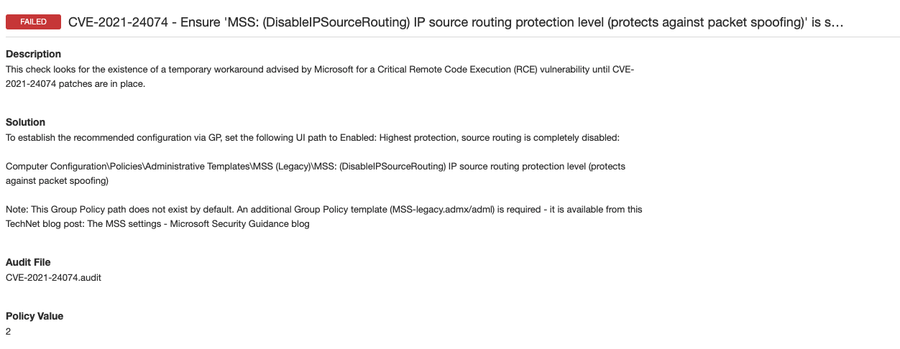
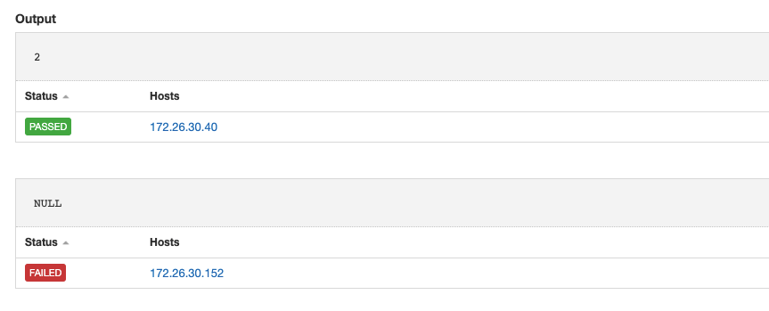

# CVE-2021-24074
Recently Microsoft released a set of workarounds for vulnerabilities found in the Microsoft TCP/IP implementation which included Remote Code Executions (RCE) vulnerabilities and a Denial of Service (DOS) vulnerability, https://msrc-blog.microsoft.com/2021/02/09/multiple-security-updates-affecting-tcp-ip/. As part of a stopgap measure until systems can be patched, Microsoft has released recommended configuration settings to be applied to vulnerable targets.

Tenable audits can be used to check for the existence of the specific configuration settings.

## Audit information

Audit check for registry setting - 'DisableIPSourceRouting'.


```
<custom_item>
  type        : REGISTRY_SETTING
  description : "CVE-2021-24074 - Ensure 'MSS: (DisableIPSourceRouting) IP source routing protection level (protects against packet spoofing)' is set to 'Enabled: Highest protection, source routing is completely disabled'"
  info        : "This check looks for the existence of a temporary workaround advised by Microsoft for a Critical Remote Code Execution (RCE) vulnerability until CVE-2021-24074 patches are in place."
  solution    : "To establish the recommended configuration via GP, set the following UI path to Enabled: Highest protection, source routing is completely disabled:
  Computer Configuration\Policies\Administrative Templates\MSS (Legacy)\MSS: (DisableIPSourceRouting) IP source routing protection level (protects against packet spoofing)
  Note: This Group Policy path does not exist by default. An additional Group Policy template (MSS-legacy.admx/adml) is required - it is available from this TechNet blog post: The MSS settings - Microsoft Security Guidance blog"
  value_type  : POLICY_DWORD
  value_data  : "2"
  reg_key     : "HKLM\SYSTEM\CurrentControlSet\Services\Tcpip\Parameters"
  reg_item    : "DisableIPSourceRouting"
  reg_option  : CAN_NOT_BE_NULL
  </condition>
```

If the registry setting is found the check will PASS. If the registry setting is not found or is misconfigured then the check will FAIL.

The full audit will produce the following results when scanned against targets:


In this example, two hosts were scanned, one that is compliant with the setting and a second that is not.

