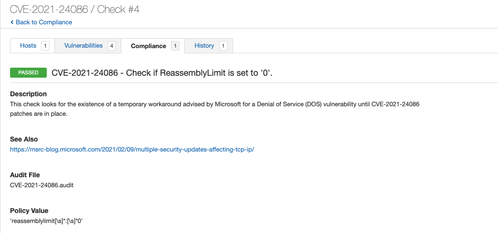
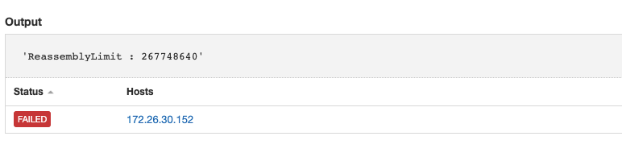

# CVE-2021-24086
Recently Microsoft released a set of workarounds for vulnerabilities found in the Microsoft TCP/IP implementation which included Remote Code Executions (RCE) vulnerabilities and a Denial of Service (DOS) vulnerability, https://msrc-blog.microsoft.com/2021/02/09/multiple-security-updates-affecting-tcp-ip/. As part of a stopgap measure until systems can be patched, Microsoft has released recommended configuration settings to be applied to vulnerable targets.

Tenable audits can be used to check for the existence of the specific configuration settings.

## Audit information


This conditional checks to verify if IPv6 is disabled.

```
<if>
  <condition type:"AND">
    <custom_item>
      type        : REGISTRY_SETTING
      description : "IPv6 is disabled"
      value_type  : POLICY_DWORD
      value_data  : "255"
      reg_key     : "HKLM\SYSTEM\CurrentControlSet\Services\TCPIP6\Parameters"
      reg_item    : "DisabledComponents"
      reg_option  : CAN_NOT_BE_NULL
    </custom_item>
  </condition>
```

If the conditional is true, (IPv6 disabled) then the check reports as a PASS.

```
<then>
    <report type:"PASSED">
      description : "IPv6 is disabled on target and CVE-2021-24086 does not apply."
      info        : "IPv6 is disabled on target and CVE-2021-24086 does not apply."
    </report>
  </then>
```

If the conditional is false, execute the <else></else> block. This will execute a Powershell check validating the 'ReassemblyLimit' configuration is set to '0'.
```
<else>
  <custom_item>
      type            : AUDIT_POWERSHELL
      description     : "CVE-2021-24086 - Check if ReassemblyLimit is set to '0'."
      info            : "This check looks for the existence of a temporary workaround advised by Microsoft for a Critical Remote Code Execution (RCE) vulnerability until CVE-2021-24086 patches are in place."
      solution        : "Set global reassemblylimit to 0
The following command disables packet reassembly. Any out-of-order packets are dropped. Valid scenarios should not exceed more than 50 out-of-order fragments. We recommend testing prior to updating production systems.
Netsh int ipv6 set global reassemblylimit=0"
      see_also        : "https://msrc-blog.microsoft.com/2021/02/09/multiple-security-updates-affecting-tcp-ip/"
      value_type      : POLICY_TEXT
      value_data      : "ReassemblyLimit[\s]*:[\s]*0"
      powershell_args : "Get-NetIPv6Protocol | SELECT 'ReassemblyLimit' | Format-List"
      check_type      : CHECK_REGEX
    </custom_item>
</else>
```


The full audit will produce the following results when scanned against targets:


In this example, a host was scanned which returned a PASS result indicating that ReassemblyLimit is configured correctly.


In this last example, a host was scanned which returned a FAIL result indicating that ReassemblyLimit is NOT configured correctly.

