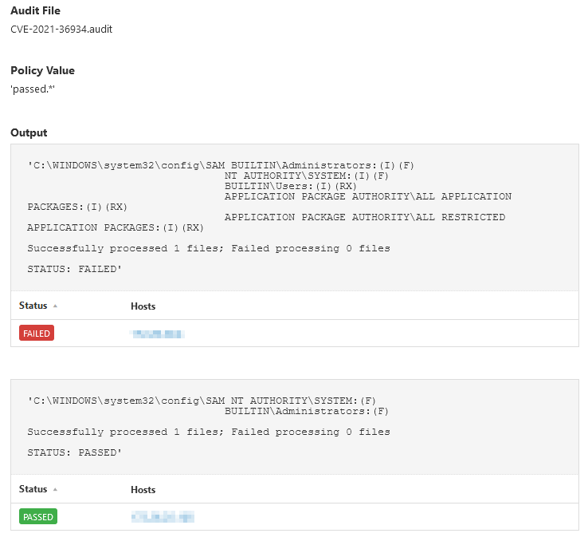

# CVE-2021-36934
Recently a Windows Elevation of Privilege Vulnerability was discovered, https://msrc.microsoft.com/update-guide/vulnerability/CVE-2021-36934. As part of a stopgap measure until systems can be patched, Microsoft released a recommended workaround.

Tenable audits can be used to check for the existence of this flaw.

## Audit information

Let's break down the audit and examine each section.

1. The Windows compliance plugin executes icacls against %windir%\system32\config\SAM, and verifies that BUILTIN\USERS does not have Read access, if so, report PASSED or FAILED:
```
<custom_item>
  type            : AUDIT_POWERSHELL
  description     : "CVE-2021-36934 - %windir%\system32\config\SAM"
    <content snipped for brevity>
  value_type      : POLICY_TEXT
  value_data      : "PASSED.*"
  powershell_args : "$acls = (icacls '%windir%\system32\config\SAM') ; $status = 'PASSED' ; foreach ($acl in $acls) { if (!$acl) { continue } elseif ($acl -like '*BUILTIN\Users:(I)(RX)') { $status = 'FAILED' } } $acls ; '' ; 'STATUS: '+$status"
  check_type      : CHECK_REGEX
</custom_item>
```
2. Additional for reporting purposes, the status of the Volume Shadow Copy service is listed. Please review the Microsoft work around for additional information regarding this service and its impact.
```
<custom_item>
  type            : AUDIT_POWERSHELL
  description     : "CVE-2021-36934 - Volume Shadow Copy service status".
    <content snipped for brevity>
  value_type      : POLICY_TEXT
  value_data      : "Manual Review Required"
  powershell_args : "Get-Service | Where {$_.Name -like 'VSS'}"
  severity        : MEDIUM
</custom_item>
```

The audit will produce the following results when scanned against a passing and failing target:

