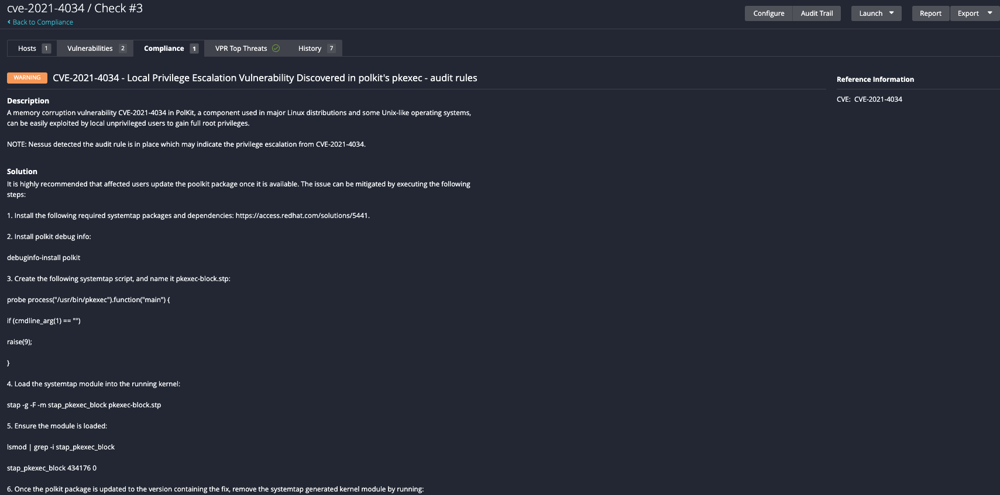
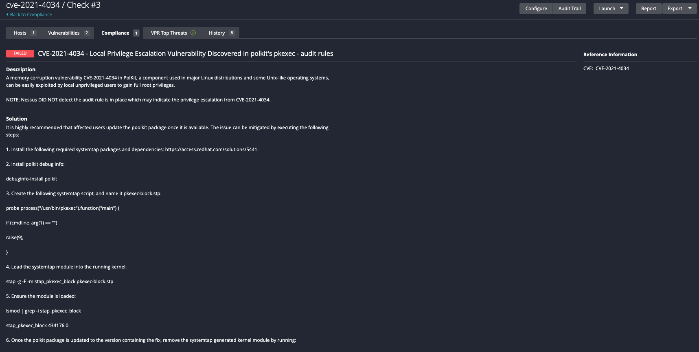

# CVE-2021-4034
A memory corruption vulnerability (CVE-2021-4034) in PolKit, a component used in major Linux distributions and some Unix-like operating systems, can be easily exploited by local unprivileged users to gain full root privileges. While the vulnerability is not exploitable remotely and doesn’t, in itself, allow arbitrary code execution, it can be used by attackers that have already gained a foothold on a vulnerable host to escalate their privileges and achieve that capability.


Tenable audits can be used to detect the audit rule is in place to help detect the local privilege escalation vulnerability found in polkit's pkexec.

NOTE: This audit does NOT detect if the system is vulnerable.

## Audit information

Let's break down the audit and its output.

1. The Unix compliance plugin executes a FILE_CONTENT_CHECK which evaluates for the existence of the specified audit rule  and reports a WARNING result if the audit rule exists or FAILED result if the audit rule does not exist.

The following audit rule is checked "-w /usr/bin/pkexec -p x -k pkexec".

```
    <custom_item>
      system      : "Linux"
      type        : FILE_CONTENT_CHECK
      description : "CVE-2021-4034 - Local Privilege Escalation Vulnerability Discovered in polkit's pkexec - audit rules"
      info        : "A memory corruption vulnerability CVE-2021-4034 in PolKit, a component used in major Linux distributions and some Unix-like operating systems, can be easily exploited by local unprivileged users to gain full root privileges."
      reference   : "CVE|CVE-2021-4034"
      see_also    : "https://cve.mitre.org/cgi-bin/cvename.cgi?name=CVE-2021-4034"
      file        : "/etc/audit/audit.rules"
      regex       : "^[\\s]*-w[\\s]+/usr/bin/pkexec[\\s]+-p[\\s]+x[\\s]+-k[\\s]+pkexec[\\s]*$"
      expect      : "^[\\s]*-w[\\s]+/usr/bin/pkexec[\\s]+-p[\\s]+x[\\s]+-k[\\s]+pkexec[\\s]*$"
    </custom_item>
```

The audit will produce the following results when scanned against a passing target:


The audit will produce the following results when scanned against a failing target:


