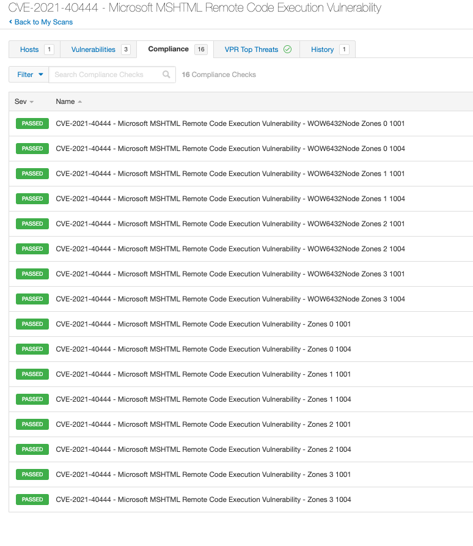
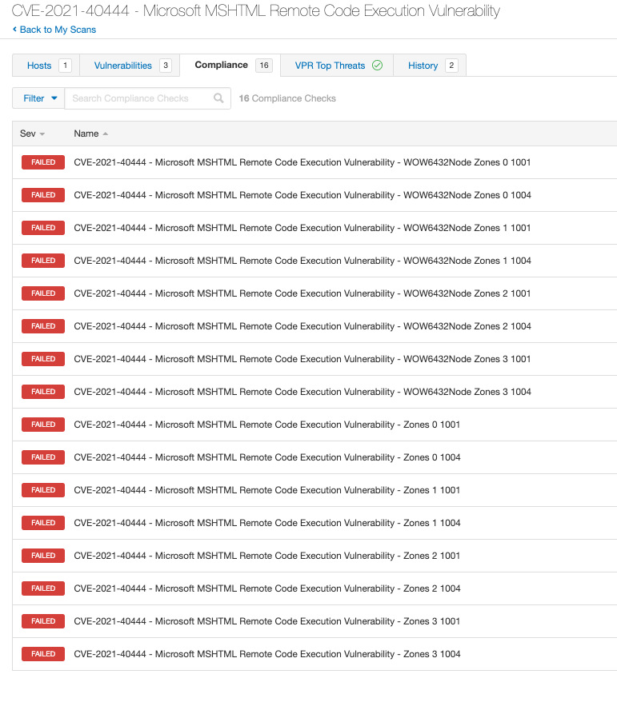
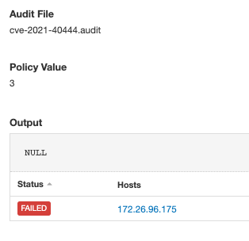

# CVE-2021-40444
Recently a remote code execution vulnerability in MSHTML that affects Microsoft Windows was discovered, https://msrc.microsoft.com/update-guide/vulnerability/CVE-2021-40444. As part of a stopgap measure until systems can be patched, Microsoft released a recommended workaround.

Tenable audits can be used to check for the existence of this flaw.

## Audit information

Let's break down the audit and its output.

1. The Windows compliance plugin executes a series of REGISTRY_SETTING checks for the existence of specified reg_items and reports a PASSED result if it exists or FAILED result if it does not exist.

The following registry paths are checked for reg_items '1001' and '1004' and value_data should be set to '3' for each.
HKLM\SOFTWARE\Policies\Microsoft\Windows\CurrentVersion\Internet Settings\Zones\[0-3]
HKLM\SOFTWARE\Policies\WOW6432Node\Microsoft\Windows\CurrentVersion\Internet Settings\Zones\[0-3]
```
<custom_item>
  type            : REGISTRY_SETTING
  description     : "CVE-2021-40444 - Microsoft MSHTML Remote Code Execution Vulnerability - Zones 0 1001"
    <content snipped for brevity>
  value_type      : POLICY_DWORD
  value_data      : 3
  reg_key         : "HKLM\SOFTWARE\Policies\WOW6432Node\Microsoft\Windows\CurrentVersion\Internet Settings\Zones\0"
  reg_item        : 1001
  reg_option      : CAN_NOT_BE_NULL
</custom_item>
```

The audit will produce the following results when scanned against a passing target:


The audit will produce the following results when scanned against a passing target:


The audit output for a failing check will show as 'NULL' due to the reg_item not existing in the registry:

