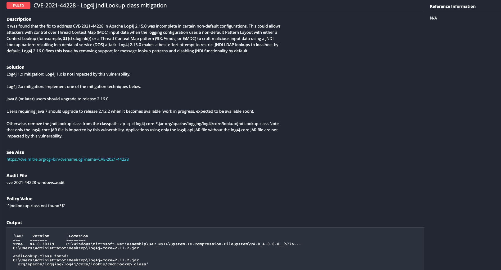

# CVE-2021-44228 / CVE-2021-45046
## CVE-2021-45046

It was found that the fix to address CVE-2021-44228 in Apache Log4j 2.15.0 was incomplete in certain non-default configurations. This could allows attackers with control over Thread Context Map (MDC) input data when the logging configuration uses a non-default Pattern Layout with either a Context Lookup (for example, $${ctx:loginId}) or a Thread Context Map pattern (%X, %mdc, or %MDC) to craft malicious input data using a JNDI Lookup pattern resulting in a denial of service (DOS) attack. Log4j 2.15.0 makes a best-effort attempt to restrict JNDI LDAP lookups to localhost by default. Log4j 2.16.0 fixes this issue by removing support for message lookup patterns and disabling JNDI functionality by default.

## CVE-2021-44228

Apache Log4j2 2.0-beta9 through 2.12.1 and 2.13.0 through 2.15.0 JNDI features used in configuration, log messages, and parameters do not protect against attacker controlled LDAP and other JNDI related endpoints. An attacker who can control log messages or log message parameters can execute arbitrary code loaded from LDAP servers when message lookup substitution is enabled. From log4j 2.15.0, this behavior has been disabled by default. From version 2.16.0, this functionality has been completely removed. Note that this vulnerability is specific to log4j-core and does not affect log4net, log4cxx, or other Apache Logging Services projects.

Tenable audits can be used to check that the new mitigation measures are in place on Windows and Linux systems. 

## Audit information

The following is a break down of the audits, scan output, and how to run the audit scans.

The audits have 3 variables that can be adjusted.  With the default values the scan will execute in a targeted manner in an attempt to balance coverage vs system load.  The 'Search Paths' variable defines the locations that will be searched.  In the default state this includes: C:\ on Windows, and /opt/ /usr/share/ /usr/local/ /usr/lib /root/ and /home/ on Unix/Linux.  You can adjust this to add or remove paths if required.  The next variable is the 'Jarfile Name Filter'.  By default it is set to 'log4j-core-*.jar', but can be switched to a value such as '*.jar' if you want all jar files on the system checked.  The final variable is 'Class Filter'.  The default value is 'org/apache/logging/log4j/core/lookup/JndiLookup.class'.

The variables can be adjusted by opening the audit file in a text editor and searching for 'variables'.  Below is an example of the 'Jarfile Name Filter.  To adjust the value, change the the text inside the 'default' tag for that variable.
```
#  <variable>
#    <name>JAR_NAME_FILTER</name>
#    <default>log4j-core-*.jar</default>
#    <description>Jarfile Name Filter</description>
#    <info>Filter to limit the jar files returned.</info>
#  </variable>
```

UNIX - The audit leverages tools installed on the system to determine if the JndiLookup.class file exists.  If python/python3 is installed, the audit will perform a more extensive test recursively scanning the jar files matching the 'Jarfile Name Filter', as well as any .ear and .war files found in the 'Search Paths'.  If python/python3 is not installed, the audit will search for jar files matching the 'Jarfile Name Filter', and analyze the contents if a common unzip utility is available on the system, as well as identify any .ear and .war files on the system.

WINDOWS - The Windows compliance plugin executes an AUDIT_POWERSHELL check which recursively scans the jar files matching the 'Jarfile Name Filter', as well as any .ear and .war files found in the 'Search Paths' If any log4j jar files are discovered on the system then the check will examine the system for the existance of the vulnerable classpath. If the vulnerable classpath is found on the system then Tenable products report a FAILED result. The solution section of the audit gives details on how to configure the mitigation. If the classpath is not detected then a PASSED result is returned.

Please see the follow for guidance on how to scan using the included audits: https://docs.tenable.com/nessus/Content/Scans.htm

The audits will produce the following results when scanned against a Windows failing target:


The audit will produce the following results when scanned against a Linux failing target:


The audits will produce the following results when scanned against a Windows passing target:


The audit will produce the following results when scanned against a Linux passing target:

