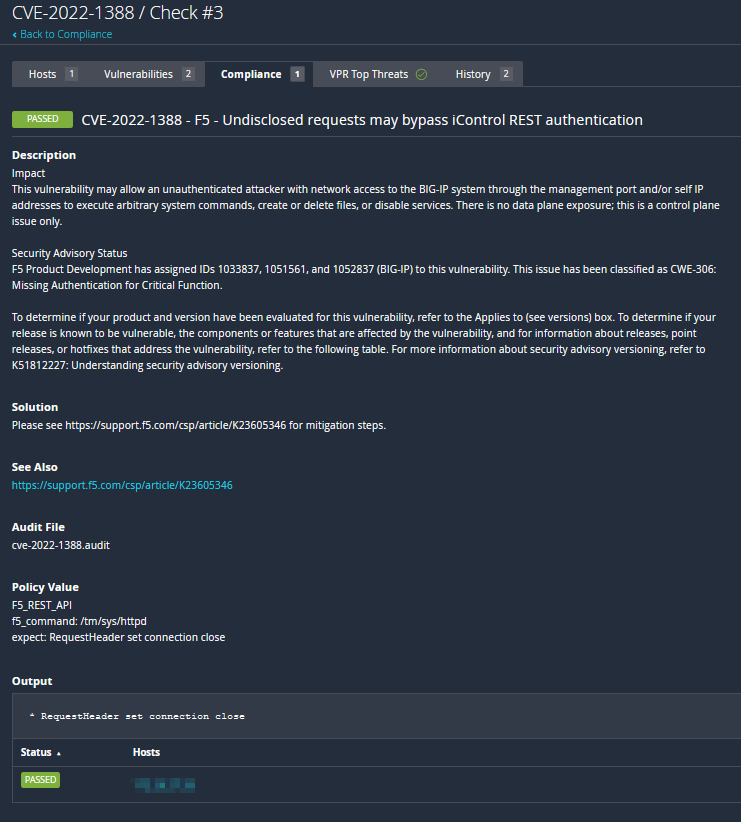
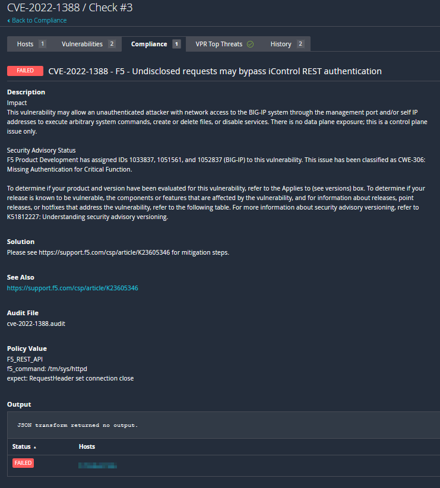

# CVE-2022-1388
From [F5 Knowledge Base K23605346](https://support.f5.com/csp/article/K23605346)
```
Security Advisory Description
Undisclosed requests may bypass iControl REST authentication. (CVE-2022-1388)

Impact

This vulnerability may allow an unauthenticated attacker with network access to the BIG-IP system through the management port and/or self IP addresses to execute arbitrary system commands, create or delete files, or disable services. There is no data plane exposure; this is a control plane issue only.
```

[mitre.org CVE-2022-1388 information](https://cve.mitre.org/cgi-bin/cvename.cgi?name=2022-1388)

Tenable audits can be used to check for the existence of the httpd mitigation.

## Audit information

Let's break down the audit and its output.

1. The F5 compliance plugin executes a check which evaluates for the existence of the specified mitigation, and reports a PASSED result if the mitigations exists or FAILED result if the mitigations do not exist.

```
    <custom_item>
      description    : "F5 CVE-2022-1388 httpd RequestHeader mitigation"
      f5_command     : "/tm/sys/httpd"
      json_transform : ".include"
      expect         : "RequestHeader set connection close"
    </custom_item>
```

This audit can be used against all versions listed at the [F5 Knowledge Base K23605346](https://support.f5.com/csp/article/K23605346) article.

The audit will produce the following results when scanned against a passing target:


The audit will produce the following results when scanned against a failing target:


