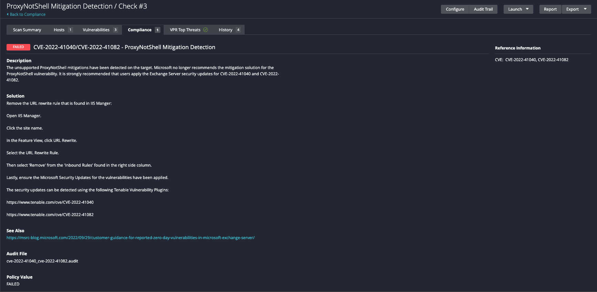

# CVE-2022-41040/CVE-2022-41082 - ProxyNotShell Mitigation Detection
CVE-2022-41082 was detected in September 2022. The vulnerability applies to Microsoft's Exchange Servers, the attack utilizes low complexity with low privilege rights. If the target is found to be vulnerable, the attacker could compromise the exchange server by leveraging PowerShell, which then could result in a full compromise. By utilizing another Microsoft vulnerability, CVE-2022-41040, an attacker could launch CVE-2022-41082 with the use of remote execution commands. Before Microsoft issued security patches for this vulnerability a mitigation solution was recommended. The mitigation utilized URL rewrite rules that are found in IIS. The mitigation solutions are no longer recommended. Microsoft recommends users install the security patches now available for both vulnerabilities. The audit that is found within this folder applies to the mitigation detection, NOT the patches.  

## Audit information

Let's break down the audit and its output.

1. The Windows compliance plug-in executes a REG_CHECK which evaluates for the existence of the specified platforms and searches for the unsupported mitigations and reports a PASSED result if the mitigations DO NOT exist or FAILED result if the mitigations exist.

The following audit check looks for the URL rewrite rule string "(?=.*autodiscover)(?=.*powershell)".

```
        <custom_item>
          type        : AUDIT_IIS_APPCMD
          description : "Test if mitigations are in place"
          value_type  : POLICY_TEXT
          value_data  : 'pattern:\\"\\(\\?\\=\\.\\*autodiscover\\)\\(\\?\\=\\.\\*powershell\\)\\"'
          appcmd_args : "list config {} /section:system.webServer/rewrite/rules /text:*"
          appcmd_list : "list sites"
          check_type  : CHECK_REGEX
        </custom_item>
```

The audit will produce the following results when scanned against a passing target (Mitigations not found):


The audit will produce the following results when scanned against a failing target (Mitigations found):

