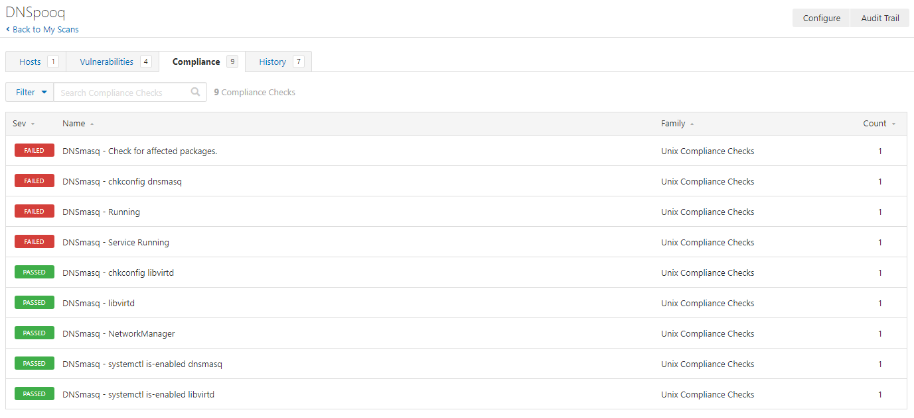

# CVE-2020-25681, CVE-2020-25682, CVE-2020-25683, CVE-2020-25684, CVE-2020-25685, CVE-2020-25686, CVE-2020-25687

## [Tenable: dnsmasq < 2.81 Denial of Service vulnerability](https://www.tenable.com/plugins/nessus/136411)
## [Tenable: DNSpooq Knowledge Base Article](https://community.tenable.com/s/article/Plugins-associated-with-the-DNSpooq-vulnerability)
## [DNSpooq Blog](https://www.jsof-tech.com/disclosures/dnspooq/)
## [Whitepaper](https://www.jsof-tech.com/wp-content/uploads/2021/01/DNSpooq_Technical-Whitepaper.pdf)
## [RedHat Advisory](https://access.redhat.com/security/vulnerabilities/RHSB-2021-001)

From the DNSpooq Blog:
"The Dnspooq vulnerabilities include DNS cache poisoning vulnerabilities as well as a potential Remote code execution and others. The list of devices using dnsmasq is long and varied. According to our internet-based research, prominent users of dnsmasq seem to include Cisco routers, Android phones, Aruba devices, Technicolor, and Red-Hat, as well as Siemens, Ubiquiti networks, Comcast, and others listed below. Depending on how they use dnsmasq, devices may be more or less affected, or not affected at all."

Tenable audits can be used to check for the existence of affected package versions and if the service is running.

## Audit information

The audit uses a conditional to verify that the target has an affected dnsmasq package:

1.
```
<if>
  <condition type:"AND">
    <custom_item>
      type        : CMD_EXEC
      description : "Affected DNSmasq package found"
      cmd         : "PKGS='dnsmasq-2.66-12.ael7b dnsmasq-2.66-13.ael7b_1 dnsmasq-2.66-14.ael7b_1 dnsmasq-2.48-4.el6 dnsmasq-2.48-5.el6 dnsmasq-2.48-5.el6_2.2 dnsmasq-2.48-6.el6 dnsmasq-2.48-13.el6 dnsmasq-2.48-13.el6_4.1 dnsmasq-2.48-13.el6_5.1 dnsmasq-2.48-14.el6 dnsmasq-2.48-14.el6_6.1 dnsmasq-2.48-16.el6_7.1 dnsmasq-2.48-16.el6_7 dnsmasq-2.48-17.el6 dnsmasq-2.48-18.el6_9 dnsmasq-2.66-10.el7 dnsmasq-2.66-12.el7 dnsmasq-2.66-13.el7_1 dnsmasq-2.66-14.el7_1 dnsmasq-2.66-14.el7_2.1 dnsmasq-2.66-14.el7_2.2 dnsmasq-2.66-21.el7 dnsmasq-2.66-21.el7_3.2 dnsmasq-2.76-2.el7 dnsmasq-2.76-2.el7_4.2 dnsmasq-2.76-5.el7 dnsmasq-2.76-7.el7 dnsmasq-2.76-7.el7_6.1 dnsmasq-2.76-9.el7 dnsmasq-2.76-10.el7_7.1 dnsmasq-2.76-14.el7 dnsmasq-2.76-15.el7 dnsmasq-2.76-16.el7 dnsmasq-2.79-4.el8 dnsmasq-2.79-5.el8 dnsmasq-2.79-6.el8 dnsmasq-2.79-11.el8 dnsmasq-2.79-11.el8_2.1 dnsmasq-2.79-13.el8'; rpm -q $PKGS | grep -v 'not installed' | awk '{print} END {if (NR == 0) print \"Pass - No packages found\"; else print \"Fail\"}'"
      expect      : "Fail"
    </custom_item>
  </condition>

```
2. If the conditional is true, execute the `<then></then>` block. The audit checks for processes and services running.
```
  <then>
    <custom_item>
      system      : "Linux"
      type        : CMD_EXEC
      description : "DNSmasq - Check for affected packages."
      info        : "This check looks for the existence of affected DNSmasq packages."
      solution    : "Remove or upgrade affected packages."
      see_also    : "https://www.jsof-tech.com/disclosures/dnspooq/"
      cmd         : "PKGS='dnsmasq-2.66-12.ael7b dnsmasq-2.66-13.ael7b_1 dnsmasq-2.66-14.ael7b_1 dnsmasq-2.48-4.el6 dnsmasq-2.48-5.el6 dnsmasq-2.48-5.el6_2.2 dnsmasq-2.48-6.el6 dnsmasq-2.48-13.el6 dnsmasq-2.48-13.el6_4.1 dnsmasq-2.48-13.el6_5.1 dnsmasq-2.48-14.el6 dnsmasq-2.48-14.el6_6.1 dnsmasq-2.48-16.el6_7.1 dnsmasq-2.48-16.el6_7 dnsmasq-2.48-17.el6 dnsmasq-2.48-18.el6_9 dnsmasq-2.66-10.el7 dnsmasq-2.66-12.el7 dnsmasq-2.66-13.el7_1 dnsmasq-2.66-14.el7_1 dnsmasq-2.66-14.el7_2.1 dnsmasq-2.66-14.el7_2.2 dnsmasq-2.66-21.el7 dnsmasq-2.66-21.el7_3.2 dnsmasq-2.76-2.el7 dnsmasq-2.76-2.el7_4.2 dnsmasq-2.76-5.el7 dnsmasq-2.76-7.el7 dnsmasq-2.76-7.el7_6.1 dnsmasq-2.76-9.el7 dnsmasq-2.76-10.el7_7.1 dnsmasq-2.76-14.el7 dnsmasq-2.76-15.el7 dnsmasq-2.76-16.el7 dnsmasq-2.79-4.el8 dnsmasq-2.79-5.el8 dnsmasq-2.79-6.el8 dnsmasq-2.79-11.el8 dnsmasq-2.79-11.el8_2.1 dnsmasq-2.79-13.el8'; rpm -q $PKGS | grep -v 'not installed' | awk '{print} END {if (NR == 0) print \"Pass - No packages found\"; else print \"Fail\"}'"
      expect      : "Pass - No packages found"
    </custom_item>

    <custom_item>
      system      : "Linux"
      type        : CMD_EXEC
      description : "DNSmasq - Running"
      info        : "This check looks for the DNSmasq process."
      solution    : "Remove or upgrade affected packages."
      see_also    : "https://www.jsof-tech.com/disclosures/dnspooq/"
      cmd         : "ps axo args | egrep \"^(/usr/sbin/)?dnsmasq\" | awk '{print} END {if (NR == 0) print \"Pass - Process not running\"; else print \"Fail\"}'"
      expect      : "Pass - Process not running"
    </custom_item>

    <custom_item>
      system      : "Linux"
      type        : CMD_EXEC
      description : "DNSmasq - Service Running"
      info        : "This check looks for the DNSmasq service process."
      solution    : "Remove or upgrade affected packages."
      see_also    : "https://www.jsof-tech.com/disclosures/dnspooq/"
      cmd         : "ps axo args | egrep \"^(/usr/sbin/)?dnsmasq((\ -k)|(\ -s\ [^\ ]+))+\" | awk '{print} END {if (NR == 0) print \"Pass - Service Process not running\"; else print \"Fail\"}'"
      expect      : "Pass - Service Process not running"
    </custom_item>

    <custom_item>
      system      : "Linux"
      type        : CMD_EXEC
      description : "DNSmasq - NetworkManager"
      info        : "This check looks for the DNSmasq NetworkManager process."
      solution    : "Remove or upgrade affected packages."
      see_also    : "https://www.jsof-tech.com/disclosures/dnspooq/"
      cmd         : "ps axo args | egrep \"^(/usr/sbin/)?dnsmasq\ (.*NetworkManager){2,6}\" | awk '{print} END {if (NR == 0) print \"Pass - NetworkManager process not running\"; else print \"Fail\"}'"
      expect      : "Pass - NetworkManager process not running"
    </custom_item>

    <custom_item>
      system      : "Linux"
      type        : CMD_EXEC
      description : "DNSmasq - libvirtd"
      info        : "This check looks for the DNSmasq libvirtd process."
      solution    : "Remove or upgrade affected packages."
      see_also    : "https://www.jsof-tech.com/disclosures/dnspooq/"
      cmd         : "ps axo args | egrep \"^(/usr/sbin/)?dnsmasq\ (.*libvirt){1,6}\" | awk '{print} END {if (NR == 0) print \"Pass - libvirtd process not running\"; else print \"Fail\"}'"
      expect      : "Pass - libvirtd process not running"
    </custom_item>

    <custom_item>
      system      : "Linux"
      type        : CMD_EXEC
      description : "DNSmasq - systemctl is-enabled dnsmasq"
      info        : "This check looks for DNSmasq enabled with systemctl."
      solution    : "Remove or upgrade affected packages."
      see_also    : "https://www.jsof-tech.com/disclosures/dnspooq/"
      cmd         : "systemctl -q is-enabled dnsmasq 2>&1 | grep -v 'No such file' | awk '{print} END {if (NR == 0) print \"Pass - dnsmasq not enabled with systemctl\"; else print \"Fail\"}'"
      expect      : "Pass - dnsmasq not enabled with systemctl"
    </custom_item>

    <custom_item>
      system      : "Linux"
      type        : CMD_EXEC
      description : "DNSmasq - systemctl is-enabled libvirtd"
      info        : "This check looks for DNSmasq enabled with systemctl."
      solution    : "Remove or upgrade affected packages."
      see_also    : "https://www.jsof-tech.com/disclosures/dnspooq/"
      cmd         : "systemctl -q is-enabled libvirtd 2>&1 | grep -v 'No such file' | awk '{print} END {if (NR == 0) print \"Pass - libvirtd not enabled with systemctl\"; else print \"Fail\"}'"
      expect      : "Pass - libvirtd not enabled with systemctl"
    </custom_item>

    <custom_item>
      system      : "Linux"
      type        : CHKCONFIG
      description : "DNSmasq - chkconfig dnsmasq"
      info        : "This check looks for DNSmasq enabled with chkconfig."
      solution    : "Remove or upgrade affected packages."
      see_also    : "https://www.jsof-tech.com/disclosures/dnspooq/"
      service     : "dnsmasq"
      levels      : "123456"
      status      : OFF
    </custom_item>

    <custom_item>
      system      : "Linux"
      type        : CHKCONFIG
      description : "DNSmasq - chkconfig libvirtd"
      info        : "This check looks for libvirtd enabled with chkconfig."
      solution    : "Remove or upgrade affected packages."
      see_also    : "https://www.jsof-tech.com/disclosures/dnspooq/"
      service     : "libvertd"
      levels      : "123456"
      status      : OFF
    </custom_item>
  </then>
```
3. If the conditional is false, execute the <else></else> block. This will return a PASSED report stating the target does not have any of the listed affected packages.
```
  <else>
    <report type:"PASSED">
      description : "The target does not have an affected DNSmasq package found to be installed."
      info        : "The target does not have an affected DNSmasq package found to be installed."
    </report>
  </else>
</if>
```
Please note if you do not want/need this `else` report, delete the entire `<else><else>` block.

The full audit will produce the following results when scanned against targets:

