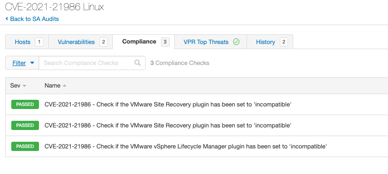

# CVE-2021-21986
Recently, VMware published an advisory (VMSA-2021-0010) regarding vulnerabilities impacting vCenter Server, [VMSA-2021-0010](https://www.vmware.com/security/advisories/VMSA-2021-0010.html). As part of a stopgap measure until systems can be patched, VMware has released recommended configuration settings to be applied to vulnerable targets.

Tenable audits can be used to check for the existence of the specific configuration settings.

Note: This .audit can only be scanned against vCenter Server targets which have bash shell configured as the default shell. - https://kb.vmware.com/s/article/2100508

## Audit information

## Linux
1. This conditional uses the vpxd command to verify if a vulnerable version of VMware vCenter Server is installed.
```
<if>
  <condition type:"AND">
    <custom_item>
      type        : CMD_EXEC
      description : "Check for vulnerable vCenter version"
      cmd         : "/usr/sbin/vpxd -v"
      expect      : "VMware VirtualCenter (6\.5\.0 build-([456789][0-9]{6}|1([0123456][0-9]{6}|7[57][0-9]{5}))|6\.7\.0 build-([89][0-9]{6}|1[0134567][0-9]{6})|7\.0\.[012] build-1([56][0-9]{6}|7([0346][0-9]{5}|92[0-9]{4})))"
    </custom_item>
  </condition>
```
2. If the conditional is true, execute the <then></then> block. The Unix compliance plugin reads the compatibility-matrix.xml file to ensure vulnerable plugins have been disabled (set to status incompatible).
```
<then>
  <custom_item>
    system      : "Linux"
    type        : FILE_CONTENT_CHECK
    description : "CVE-2021-21986 - Check if the VMware Site Recovery plugin has been set to 'incompatible'"
    info        : "This check looks for the existence of a temporary workaround advised by VMware for a vulnerability in the VMware Site Recovery plugin shipped with vCenter Server until CVE-2021-21986 patches are in place."
    solution    : "The VMware Site Recovery plugin must be set to 'incompatible' in /etc/vmware/vsphere-ui/compatibility-matrix.xml. Disabling the plugin from within the UI will not protect the system from this vulnerability.

To disable all plugins with disclosed vulnerabilities, add the following lines as shown below:
Note: These entries should be added between the --> and <-- entries between WHITE LIST and BLACK LIST.

<PluginPackage id=\"com.vmware.vrops.install\" status=\"incompatible\"/>
<PluginPackage id=\"com.vmware.vsphere.client.h5vsan\" status=\"incompatible\"/>
<PluginPackage id=\"com.vmware.vrUi\" status=\"incompatible\"/>
<PluginPackage id=\"com.vmware.vum.client\" status=\"incompatible\"/>
<PluginPackage id=\"com.vmware.h4.vsphere.client\" status=\"incompatible\"/>"
    see_also    : "https://kb.vmware.com/s/article/83829"
    file        : "/etc/vmware/vsphere-ui/compatibility-matrix.xml"
    regex       : "^[\\s]*\<PluginPackage id=\"com.vmware.vrUi.install\""
    expect      : "\<PluginPackage id=\"com.vmware.vrUi\" status=\"incompatible\"/>"
  </custom_item>

  <custom_item>
    system      : "Linux"
    type        : FILE_CONTENT_CHECK
    description : "CVE-2021-21986 - Check if the VMware vSphere Lifecycle Manager plugin has been set to 'incompatible'"
    info        : "This check looks for the existence of a temporary workaround advised by VMware for a vulnerability in the VMware Site Recovery plugin shipped with vCenter Server until CVE-2021-21986 patches are in place."
    solution    : "The VMware vSphere Lifecycle Manager plugin must be set to 'incompatible'. Disabling the plugin from within the UI will not protect the system from this vulnerability.

To disable all plugins with disclosed vulnerabilities, add the following lines as shown below:
Note: These entries should be added between the --> and <\-- entries between WHITE LIST and BLACK LIST.

<PluginPackage id=\"com.vmware.vrops.install\" status=\"incompatible\"/>
<PluginPackage id=\"com.vmware.vsphere.client.h5vsan\" status=\"incompatible\"/>
<PluginPackage id=\"com.vmware.vrUi\" status=\"incompatible\"/>
<PluginPackage id=\"com.vmware.vum.client\" status=\"incompatible\"/>
<PluginPackage id=\"com.vmware.h4.vsphere.client\" status=\"incompatible\"/>"
    see_also    : "https://kb.vmware.com/s/article/83829"
    file        : "/etc/vmware/vsphere-ui/compatibility-matrix.xml"
    regex       : "^[\\s]*\<PluginPackage id=\"com.vmware.vum.client\""
    expect      : "\<PluginPackage id=\"com.vmware.vum.client\" status=\"incompatible\"/>"
  </custom_item>

  <custom_item>
    system      : "Linux"
    type        : FILE_CONTENT_CHECK
    description : "CVE-2021-21986 - Check if the VMware Site Recovery plugin has been set to 'incompatible'"
    info        : "This check looks for the existence of a temporary workaround advised by VMware for a vulnerability in the VMware Site Recovery plugin shipped with vCenter Server until CVE-2021-21986 patches are in place."
    solution    : "The VMware Site Recovery plugin must be set to 'incompatible'. Disabling the plugin from within the UI will not protect the system from this vulnerability.

To disable all plugins with disclosed vulnerabilities, add the following lines as shown below:
Note: These entries should be added between the --> and <\-- entries between WHITE LIST and BLACK LIST.

<PluginPackage id=\"com.vmware.vrops.install\" status=\"incompatible\"/>
<PluginPackage id=\"com.vmware.vsphere.client.h5vsan\" status=\"incompatible\"/>
<PluginPackage id=\"com.vmware.vrUi\" status=\"incompatible\"/>
<PluginPackage id=\"com.vmware.vum.client\" status=\"incompatible\"/>
<PluginPackage id=\"com.vmware.h4.vsphere.client\" status=\"incompatible\"/>"
    see_also    : "https://kb.vmware.com/s/article/83829"
    file        : "/etc/vmware/vsphere-ui/compatibility-matrix.xml"
    regex       : "^[\\s]*\<PluginPackage id=\"com.vmware.h4.vsphere.client\""
    expect      : "^[\\s]*\<PluginPackage id=\"com.vmware.h4.vsphere.client\" status=\"incompatible\"/>"
  </custom_item>
</then>
```
3. If the conditional is false, execute the <else></else> block. This will return a PASSED report stating that a vulnerable vCenter Server version/build was not detected. If it is desired to not have this report and return nothing, the entire <else></else> section can be deleted.
```
<else>
  <report type:"PASSED">
    description : "CVE-2021-21986 does not apply to this vCenter Server version/build."
    info        : "CVE-2021-21986 does not apply to this vCenter Server version/build."
    see_also    : "https://kb.vmware.com/s/article/83829"
  </report>
</else>
```

The full audit will produce the following results when scanned against targets:

